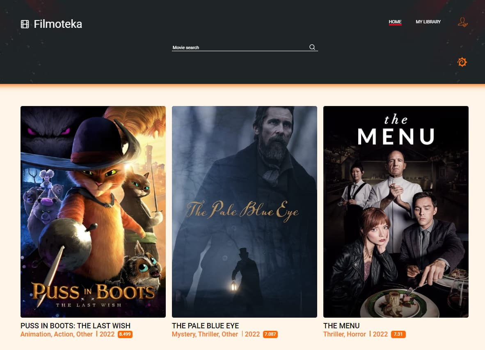

# Team BRAVE PEOPLE presents the project FILMOTEKA

  

## ПОРТРЕТ КОРИСТУВАЧА

### Василина

40 років.

Відчайдушна домогосподарка.

У перервах між повсякденними справами, любить проводити час за переглядом улюблених фільмів та серіалів.
Обожнює як комедії так і романтичні фільми, але головне захоплення Василини - це індійське кіно.
Потребує додаток, в якому вона могла би планувати своє дозвілля, додаючи фільми до черги на перегляд, 
а також відмічати вже переглянуті фільми, бо їх вже ой-ой-ой скільки було, що важко всі запам'ятовувати.

  

## ГОЛОВНА ІДЕЯ ПРОЕКТУ

Створити ідеальну фільмотеку зі зручним інтерфейсом та корисними функціями.

### Зручний інтерфейс

Тепер не треба витрачати час на пошуки потрібних кнопочок - всі вони вже на головному екрані! 
Користувачу варто лише зареєструватися і насолоджуватися використанням нашого додатку, в повній мірі відчувши всі його переваги!

### Корисний функціонал

Можливість додавати фільми до черги на перегляд, що допоможе спланувати дозвілля користувача. 
Реалізовано можливіть переміщення фільмів до вкладки "Переглянуті". 
Нарешті користувач зможе уникнути ситуації, коли несподівано виявиться, що фільм, 
який він почав переглядати, після довгих мук вибору, він вже колись дивився...

### Простота у використанні

Завдяки простоті у використанні, наш додаток швидко можуть освоїти користувачі будь-якого віку. З ним з легкістю впорається навіть дитина.

## ТЕХНОЛОГІЇ ЯКІ ВИКОРИСТОВУВАЛИСЬ

### Front-end

- HTML/CSS
- JavaScript
- Axios
- Basiclightbox
- Notiflix
- Tui-pagination

### Back-end

- Node.js
- Firebase
- API TMDB

### Utilites

- VSCode
- Parcel
- Figma
- Git/GitHub

### Термін виконання 

14 днів

## ДЯКУЄМО ЗА УВАГУ! 

<!--  -->

  

